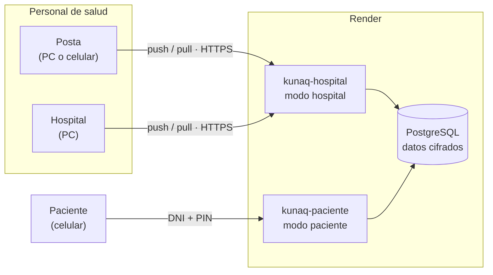
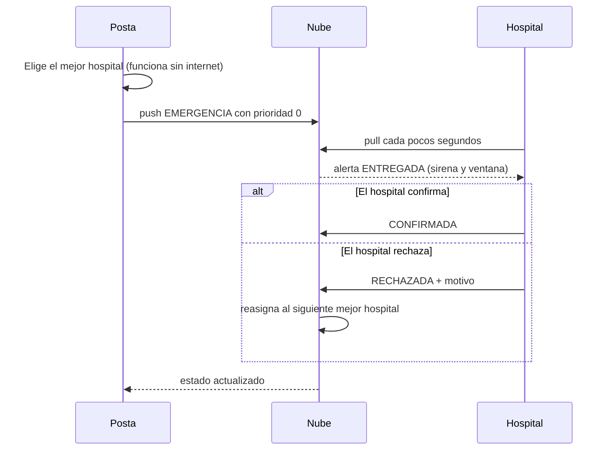

<p align="center">
  
</p>

<h1 align="center">Kunaq · Red de Salud Rural</h1>

<p align="center">
  <b>Historias clínicas, inventario de medicamentos y alertas de emergencia<br>entre postas y hospitales, incluso con internet débil.</b>
</p>

<p align="center">
  <a href="https://github.com/FluxJK/Kunaq/actions/workflows/pruebas.yml"></a>
  
  
  
  
</p>

<p align="center">
  <a href="#-qué-es-kunaq">Qué es</a> ·
  <a href="#-cómo-probarlo">Probarlo</a> ·
  <a href="#-publicar-en-render">Render</a> ·
  <a href="#-seguridad">Seguridad</a> ·
  <a href="#-api">API</a> ·
  <a href="#-conceptos-aplicados">Conceptos</a>
</p>

---

## 🌄 Qué es Kunaq

En las zonas rurales una posta de salud puede quedarse **sin internet** justo cuando llega una emergencia. Kunaq está pensado para esa realidad:

- 🏥 **Cada posta u hospital trabaja aunque no haya señal.** Todo se guarda en el equipo y se envía solo cuando vuelve la conexión.
- 🚑 **Las emergencias se derivan al mejor hospital disponible** según lo que el paciente necesita (UCI, ventilador, quirófano…), la distancia y la señal.
- 💊 **El inventario de 20 medicamentos se comparte entre equipos** sin que dos postas se pisen el stock.
- 📱 **El paciente consulta su propio historial** con su DNI y un PIN, en un portal aparte.

### Funciones principales

| | Función | Cómo funciona |
|---|---|---|
| 🔐 | **Cuentas del personal** | Usuario y contraseña, sesión de 24 h, el administrador crea las cuentas. |
| 🧑‍⚕️ | **Panel médico** | Registrar atenciones, buscar historiales, emergencias e inventario. |
| 🔗 | **Vinculación de equipos** | Cada PC se registra como posta, centro de salud u hospital, con sus implementos y camas UCI. |
| 🚨 | **Alertas de emergencia** | Sirena y ventana en el hospital; si rechaza, se reasigna al siguiente automáticamente. |
| 📶 | **Sincronización para señal débil** | Cola de salida, lotes pequeños, reintentos espaciados y solo se descarga lo nuevo. |
| 🩺 | **Portal del paciente** | DNI + PIN de 6 dígitos, el servidor devuelve solo su historial. |
| 🛡️ | **Datos protegidos** | Nombres y datos clínicos cifrados en la base; DNI protegido con HMAC. |

---

## 🧭 Arquitectura



Hay **dos portales separados** que comparten la misma base de datos. El portal de pacientes ni siquiera contiene el código de sincronización ni las páginas del personal.

| Modo (`KUNAQ_MODO`) | Quién lo usa | Qué sirve | Qué NO sirve |
|---|---|---|---|
| `hospital` | Postas y hospitales | `index.html`, `admin.html`, `/api/sync/*`, `/api/personal/*` (exige cuenta) | `paciente.html` y la consulta de pacientes |
| `paciente` | Pacientes | `paciente.html` y `POST /api/paciente/consulta` | Todo lo demás: ni `kunaq-core.js`, ni panel, ni sincronización |
| `todo` | Pruebas en una PC | Todo junto | — |

---

## 📁 Estructura del proyecto

```
Kunaq/
├── views/
│   ├── index.html          Portada del personal: inicio de sesión, vincular equipo, cuentas
│   ├── admin.html          Panel médico: atenciones, emergencias, inventario, búsqueda
│   └── paciente.html       Portal del paciente (consulta la nube con DNI + PIN)
├── assets/
│   ├── kunaq-core.js       Motor del navegador: cola, sincronización, controlador, interfaz
│   ├── kunaq-core.css      Estilos
│   └── *.png               Logo, ícono y favicon
├── server/
│   └── servidor_nube.py    Servidor: API, base de datos, cuentas, cifrado, modos
├── models/
│   ├── entidades.py        Clases POO + Dispositivo + ControladorEmergencias
│   └── inventario_base.py  Los 20 medicamentos iniciales
├── utils/seguridad.py      Utilidades de hash y cifrado (las usa scripts/semilla_db.py)
├── scripts/semilla_db.py   Crea una base SQLite de ejemplo
├── tests/prueba_nube.py    50 pruebas automáticas del servidor
├── sw.js                   Service worker: abrir las páginas sin internet
├── render.yaml             Despliegue automático en Render
├── requirements.txt        Dependencias de producción
└── .github/workflows/      Pruebas automáticas en cada push
```

> `sw.js` está en la raíz a propósito: un service worker solo controla las páginas que están en su carpeta o debajo.

### Tecnologías

**Python** (servidor con la librería estándar) · **JavaScript** puro, sin frameworks · **SQLite** (pruebas) y **PostgreSQL** (producción) · **Fernet / PBKDF2 / HMAC** para seguridad · **Render** para publicar · **GitHub Actions** para pruebas.

---

## 🚀 Cómo probarlo

### Opción A · Sin instalar nada (practicar en una sola PC)

1. Abre `views/index.html` con doble clic en **dos pestañas**.
2. En cada una escribe la clave de práctica `0000`, llena el formulario, marca *Modo demostración* y pulsa **Vincular esta PC**. Una pestaña como **Hospital** (marca sus implementos) y la otra como **Posta**.
3. En la posta: *Panel Médico → Emergencia* → elige un caso → **Enviar alerta**. En el hospital salta la sirena.

### Opción B · Nube real en tu PC o red WiFi

Solo necesitas Python 3.10 o superior.

```bash
python server/servidor_nube.py
```

Abre la dirección que aparece (`http://<IP-de-la-PC>:8765/views/index.html`) en cada equipo conectado a la misma red.

Para exigir **cuentas con usuario y contraseña**, como en producción:

```bash
# Windows (cmd)                          # Linux / Mac
set KUNAQ_ADMIN_CLAVE=MiClave2026        export KUNAQ_ADMIN_CLAVE=MiClave2026
python server/servidor_nube.py
```

Entra como `admin` y crea las cuentas del personal desde la portada (*Cuentas del personal*).

Para probar el portal del paciente con un caso de ejemplo, arranca con `KUNAQ_SEMILLA_DEMO=1`: el paciente es **DNI `70123456`, PIN `1234`**. No lo uses con datos reales.

> ℹ️ Con `http://192.168.x.x` el service worker no se activa (necesita HTTPS o `localhost`). Con Render sí.

### Opción C · Publicarlo en internet → [ver Render](#-publicar-en-render)

---

## ☁️ Publicar en Render

Guía detallada con comandos de Git: [`GUIA_GITHUB_RENDER.md`](GUIA_GITHUB_RENDER.md). Resumen:

1. Sube el proyecto a GitHub (`render.yaml` debe quedar en la **raíz**).
2. En [render.com](https://render.com): **New → Blueprint** → elige el repositorio → **Apply**.
3. Se crean automáticamente `kunaq-db` (PostgreSQL), `kunaq-hospital` y `kunaq-paciente`. Render te pedirá escribir **`KUNAQ_ADMIN_CLAVE`**, la contraseña del administrador (mínimo 8 caracteres).
4. **Guarda `KUNAQ_LLAVE` y `KUNAQ_PEPPER`** en un lugar seguro (*Environment Groups → kunaq-secretos*). Si se pierden, los datos cifrados no se pueden recuperar.
5. Si el servicio del paciente no se llama `kunaq-paciente`, corrige `KUNAQ_URL_PACIENTE` en `kunaq-hospital`.

Después, cada `git push` a `main` vuelve a publicar solo.

> ⚠️ **Plan gratuito de Render** (verifica en su documentación, puede cambiar): la base PostgreSQL gratuita **expira a los 30 días** y los servicios gratuitos **se duermen a los 15 minutos** sin uso (tardan cerca de 1 minuto en despertar). Sirve para una demostración. Para uso real, un plan de pago o una base permanente (Neon, Supabase) pegando su cadena en `DATABASE_URL`.

### Variables de entorno

| Variable | Qué hace | Obligatoria |
|---|---|---|
| `KUNAQ_MODO` | `todo`, `hospital` o `paciente` | En producción |
| `DATABASE_URL` | Conexión a PostgreSQL (si falta, usa SQLite) | En Render |
| `KUNAQ_ADMIN_CLAVE` | Contraseña del administrador (mín. 8 caracteres) | Modo `hospital` |
| `KUNAQ_ADMIN_USUARIO` | Nombre del administrador (por defecto `admin`) | No |
| `KUNAQ_PEPPER` | Secreto que protege los DNI. **Igual en ambos servicios** | `hospital` y `paciente` |
| `KUNAQ_LLAVE` | Secreto que cifra nombres y datos clínicos. **Igual en ambos** | `hospital` y `paciente` |
| `KUNAQ_URL_PACIENTE` | Dirección pública del portal del paciente (enlace en la portada) | No |
| `KUNAQ_SESION_HORAS` | Duración de la sesión del personal (por defecto 24) | No |
| `KUNAQ_CORS` | Origen permitido para CORS (por defecto `*` solo en modo `todo`) | No |
| `KUNAQ_SEMILLA_DEMO` | `1` crea un paciente de prueba | No |
| `KUNAQ_TOKEN` | Código de red compartido (heredado, opcional) | No |

---

## 🚨 Emergencias



### ¿A qué hospital se deriva?

`ControladorEmergencias` usa **funciones de orden superior**, tanto en Python (`models/entidades.py`) como en JavaScript (`assets/kunaq-core.js`) para que la posta pueda decidir sin internet:

```
hospitales → filter(es_receptor) → filter(no_excluido) → filter(está_vivo)
           → map(puntuar(requisitos, origen))      # función que devuelve otra función
           → sorted(key=lambda …) → reduce(mejor)
```

**Puntaje** = cobertura de lo que necesita el paciente (100) + categoría MINSA (12 por nivel) + camas UCI libres (3 por cama, hasta 5) − distancia (0,5 por km, hasta 100) − 40 si la señal es débil.

Un hospital está *en línea* si se vio hace 45 s o menos, y con *señal débil* hasta 180 s.

---

## 📶 Qué pasa cuando la señal es mala

| Problema | Cómo lo resuelve |
|---|---|
| No hay internet | Todo se guarda en el equipo (`localStorage`) y entra en una **cola de salida**. |
| Internet intermitente | Envía en lotes de 15, con **límite de 8 s** y reintentos cada vez más espaciados (3 s → 60 s). |
| El mismo envío llega dos veces | Cada cambio tiene un **ID único**; la nube ignora los repetidos (*idempotencia*). |
| Dos postas descuentan el mismo medicamento | Se envía el **cambio** (−1), no el valor final: no se pisan. El stock nunca baja de 0. |
| Poco ancho de banda | Solo baja lo **nuevo** (`cursor`) y las respuestas son JSON mínimo. |
| Emergencia con señal débil | Va con **prioridad 0**: sale antes que cualquier otro cambio. |
| Abrir la página sin internet | `sw.js` guarda las páginas en el equipo (con HTTPS o `localhost`). |

💡 **Para exponer:** marca *Simular sin internet*, registra una emergencia y observa el contador **"por enviar"**. Al desmarcarlo, la alerta llega al hospital.

---

## 🩺 Cómo entra un paciente

1. La posta registra la primera atención y el sistema genera un **PIN aleatorio de 6 dígitos**, que se entrega en persona.
2. El PIN viaja una sola vez a la nube, que guarda **solo su hash**. El DNI tampoco se guarda tal cual: se guarda un HMAC con un secreto.
3. En el portal del paciente escribe DNI + PIN. **El servidor valida**, limita los intentos y devuelve **solo su historial**.
4. Si pierde el PIN: búsqueda del personal → **Generar PIN nuevo**.

---

## 🛡️ Seguridad

| Qué se protege | Con qué |
|---|---|
| Contraseñas del personal | PBKDF2-SHA256 (200 000 iteraciones) con sal aleatoria. Nunca en claro. |
| PIN del paciente | El mismo PBKDF2. Se compara en tiempo constante y se calcula aunque el DNI no exista. |
| DNI | SHA-256 en el equipo + **HMAC con secreto** (`KUNAQ_PEPPER`) en el servidor. La base no contiene el DNI. |
| Nombres y datos clínicos | **Fernet** (AES-128-CBC + HMAC-SHA256) con `KUNAQ_LLAVE`, cifrados en la base. |
| Sesiones | Token aleatorio; en la base solo se guarda su SHA-256. Vence a las 24 h y se invalida al desactivar la cuenta o cerrar sesión. |
| Fuerza bruta | Personal: 5 fallos por cuenta → 15 min. Paciente: 5 fallos por DNI → 30 min. También hay límite por IP. |
| Inyección SQL | Todas las consultas usan parámetros (`?`), nunca texto pegado. |
| XSS | Todo texto se escapa antes de mostrarse (`esc()`). |
| Acceso a archivos | Lista blanca de extensiones y protección contra salir de la carpeta del proyecto. |
| Separación | El portal del paciente no sirve el panel ni el motor de sincronización. |
| Cabeceras | `X-Content-Type-Options`, `X-Frame-Options: DENY`, `Referrer-Policy`. |

### Límites (para ser honestos en la exposición)

- En el navegador el cifrado es una **codificación Base64** (didáctica). La protección real está en el servidor y en HTTPS.
- El `localStorage` del equipo guarda los datos locales sin cifrar, como cualquier aplicación web.
- Un PIN de 6 dígitos con límite de intentos reduce el riesgo, pero no lo elimina.
- La clave `0000` solo existe en **modo práctica**, cuando el servidor no exige cuentas.
- Datos reales de pacientes exigirían cumplir la **Ley 29733** (consentimiento y registro del banco de datos) y una auditoría de seguridad.

---

## 🔌 API

| Método y ruta | Quién | Para qué |
|---|---|---|
| `GET /api/ping` | Todos | Estado del servidor y si exige inicio de sesión |
| `POST /api/personal/login` | Personal | Inicia sesión y devuelve el token |
| `POST /api/personal/logout` | Personal | Cierra la sesión |
| `POST /api/personal/crear` | Administrador | Crea o actualiza una cuenta |
| `POST /api/personal/desactivar` | Administrador | Desactiva una cuenta y cierra sus sesiones |
| `GET /api/personal/lista` | Administrador | Lista las cuentas |
| `POST /api/sync/push` | Personal | Envía operaciones (máx. 50 por lote) |
| `GET /api/sync/pull?dispositivo=&cursor=` | Personal | Descarga solo lo nuevo |
| `GET /api/atenciones?dni_hash=` | Personal | Busca el historial de un paciente |
| `POST /api/paciente/consulta` | Paciente | Valida DNI + PIN y devuelve su historial |

El token va en el encabezado `X-Kunaq-Token`.

---

## 🧪 Pruebas

```bash
pip install -r requirements.txt
python tests/prueba_nube.py sqlite      # 50 comprobaciones con SQLite
python tests/prueba_nube.py pg          # las mismas con PostgreSQL (requiere: pip install pgserver)
```

Cubren la separación de portales, el PIN y el bloqueo por intentos, las cuentas y sus permisos, el cifrado en la base, las emergencias con reasignación, el stock y la idempotencia. GitHub las ejecuta solas en cada `push`.

---

## 🎓 Conceptos aplicados

| Concepto | Dónde |
|---|---|
| **Herencia** | `Paciente(Persona)` en `models/entidades.py` |
| **Encapsulamiento** | `_nombres` (protegido), `__dni_hash` (privado) y la llave de `SeguridadKunaq` |
| **Polimorfismo** | `obtener_identidad()` redefinido; `NubeSimulada` y `NubeHTTP` con la misma interfaz |
| **Composición** | `Paciente` tiene una `FichaMedica` |
| **Funciones de orden superior** | `filter`, `map`, `sorted(key=lambda)`, `reduce` en `ControladorEmergencias`; `pipe()` en el JS |
| **Manejo de excepciones** | `try/except` en el cifrado, el servidor y la sincronización |
| **Offline-first** | Cola de salida, idempotencia y reintentos con espera creciente |
| **Seguridad de datos personales** | Hash, HMAC, cifrado en reposo, roles y mínimo privilegio (Ley 29733) |

---

## 🗺️ Próximos pasos

- Cifrado de extremo a extremo en el navegador (hoy es didáctico).
- Notificaciones push cuando la página del hospital está cerrada.
- Recuperación de contraseña por correo y registro de auditoría de accesos.
- Base de datos permanente y copias de seguridad automáticas.

---

<p align="center">
  Proyecto universitario · hecho con ❤️ para acercar la salud a quienes más lo necesitan
</p>